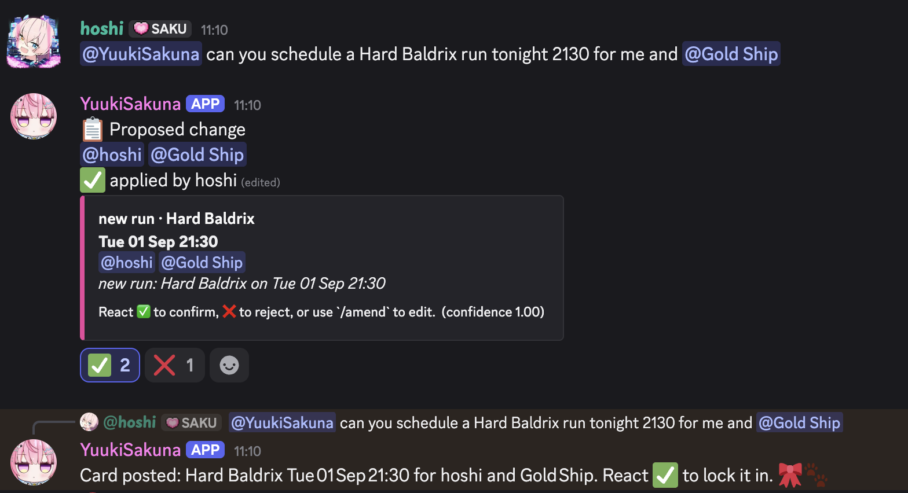

# kanade-bot

A Discord bot that keeps a MapleStory group's weekly boss schedule and posts
tagged reminders.

You set baseline timings with `/fixed`, the bot materialises them into concrete
runs each boss week, and it pings exactly the people on each run — a grouped
morning message plus countdowns — with ✅/❌ reactions as the attendance record.
On top of that it **reads the party's chat** with a local LLM and posts a card
proposing the change it found; nothing reaches the schedule until someone reacts
✅. A **mention-gated chatbot** answers scheduling questions in its own channel
and drafts changes through the same cards. And it serves a **web portal and a
`bossctl` CLI** on `127.0.0.1:8080`, reachable from your phone over Tailscale.



## What it does

|                      |                                                                                                                                                                                   |
| -------------------- | --------------------------------------------------------------------------------------------------------------------------------------------------------------------------------- |
| **Membership**       | Anyone with the `BOSSING_ROLE` is a known bosser. The roster syncs from the role — no `/roster` upkeep.                                                                            |
| **Baseline**         | `/fixed add` records a weekly timing (`HStar, HFA — Mon 21:30 — @a @b @c`). Many parties coexist; the bot has no concept of "the" party.                                          |
| **Weekly runs**      | At each boss-week reset the baseline becomes concrete runs for the current and next week; finished runs drop out on their own.                                                     |
| **Reminders**        | One grouped day-of message per party channel each morning, plus countdown pings at T-1h and T-15m. Reminder state lives in SQLite, so restarts never lose or replay a ping.        |
| **RSVPs**            | ✅/❌ reactions on every reminder. All-✅ confirms the run; a ❌ marks it at-risk and tags the rest to reschedule.                                                                    |
| **Changes**          | `/amend`, `/status`, `/swap`, `/rsvp` and friends; every change made outside Discord is announced in the run's home channel.                                                       |
| **Chat extraction**  | A local `gpt-oss:20b` reads the party channels and posts a ✅/❌ card for each change it finds. Nothing applies without a human ✅; unanswered cards expire.                        |
| **Chatbot**          | Mention-gated, role-gated, rate-limited, in its own channel, with a persona. Read tools answer directly; write tools post the same ✅/❌ cards — it never writes to the schedule.   |
| **Portal & CLI**     | Week view, fixed-timing editor, proposal inbox, extraction log, chat analytics and config — one API inside the bot process, loopback only, tailnet via the bundled Caddy front door.          |

## Quickstart

```sh
# 1. Create the Discord application and copy your ids  ->  docs/setup.md
cp .env.example .env && $EDITOR .env

# 2. Run it
docker compose up --build
```

The must-set variables are `DISCORD_TOKEN`, `GUILD_ID`, `BOSSING_ROLE_ID`, and
at least one of `CHAT_CHANNEL_IDS` / `CHAT_CATEGORY_IDS`. Everything else is
documented inline in [`.env.example`](.env.example) and has sensible defaults.

## Documentation

| Guide                                  | What is in it                                                                     |
| -------------------------------------- | --------------------------------------------------------------------------------- |
| [Setup](docs/setup.md)                 | Discord developer portal, intents, invite permissions, `.env`, running, troubleshooting |
| [Commands](docs/commands.md)           | Every slash command, how ids and boss tokens work, testing with `/debug`          |
| [The chat extractor](docs/extractor.md)| How chat becomes proposal cards, rescans, tuning, exporting history               |
| [The chatbot](docs/chatbot.md)         | The persona chatbot: gates, tools, setup, voice tuning, tracing its decisions     |
| [Portal, CLI and API](docs/portal.md)  | The web portal, tailnet access, `bossctl`, the JSON API                           |
| [Development](docs/development.md)     | Tests, lint, and the module layout                                                |

Release history is in [CHANGELOG.md](CHANGELOG.md). Licensed under the
[MIT License](LICENSE).
